# ARP Spoofing Attack (Man-in-the-Middle)

## Overview

Communication between systems logically uses IP addresses, but actual communication within a local network occurs using MAC addresses through the Address Resolution Protocol (ARP). ARP maps a known IP address to its corresponding MAC address. In an ARP spoofing attack, the attacker continuously sends forged ARP reply packets with a fake MAC address, causing the victim to associate the attacker’s MAC address with the gateway or another legitimate host. As a result, traffic is redirected through the attacker system, enabling Man-in-the-Middle (MITM) attacks. These activities are not directly visible in Splunk unless a monitoring tool is used. In this setup, arpwatch is installed on the victim machine to monitor ARP table changes and generate alerts whenever MAC address changes are detected. The generated logs are then forwarded to Splunk for analysis and monitoring.

## 1. Environment Setup

Install `dsniff` on the attacker machine (Kali Linux). The `dsniff` package includes `arpspoof`, which will be used to carry out the ARP poisoning attack.

```bash
sudo apt update
sudo apt install dsniff -y
```

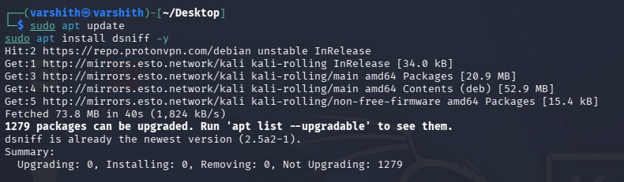


## 2. Network Reconnaissance

Identify the attacker machine's network interface and IP address using `ip a`, and confirm the default gateway using `ip route`.

```bash
ip a
ip route
```

From the output:
- Attacker IP: `10.155.14.121`
- Interface: `eth0`
- Default Gateway (Router): `10.155.14.37`
- Victim IP (target): `10.155.14.161`


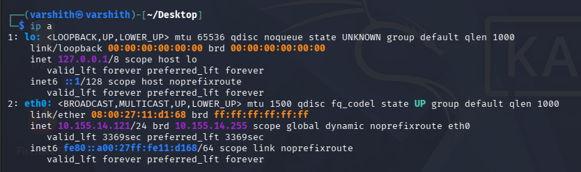


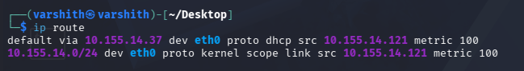


## 3. Enabling IP Forwarding

IP forwarding must be enabled on the attacker machine so that intercepted packets are forwarded to their intended destination. Without this, the victim and gateway would lose connectivity, making the attack obvious. To achieve this we must make changes to a virtual file which lets the attacker to forward packets, when this file has the value '0' then the system will be instructed to drop any packets it recieves. This value will be reset everytime the system is rebooted.

```bash
echo 1 | sudo tee /proc/sys/net/ipv4/ip_forward
cat /proc/sys/net/ipv4/ip_forward
```

The output `1` confirms that IP forwarding is now active.

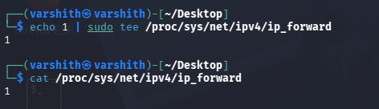


## 4. Performing the ARP Spoofing Attack

Two `arpspoof` commands are run simultaneously in separate terminals. The first poisons the victim's ARP cache to make the attacker appear as the gateway. The second poisons the gateway's ARP cache to make the attacker appear as the victim. Together, they route all traffic through the attacker.

**Terminal 1 - Tell the victim that the attacker is the gateway:**

```bash
sudo arpspoof -i eth0 -t 10.155.14.161 10.155.14.37
```


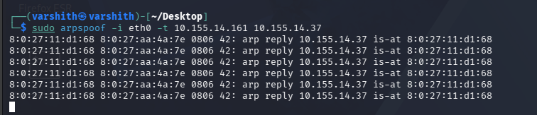

**Terminal 2 - Tell the gateway that the attacker is the victim:**

```bash
sudo arpspoof -i eth0 -t 10.155.14.37 10.155.14.161
```


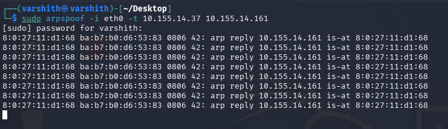

At this point the attacker is positioned as a man-in-the-middle and can intercept all traffic between the victim and the gateway.


## 5. Detection via ARP Table Anomaly

On the victim machine, running `ip neigh` repeatedly reveals the ARP table. A key indicator of ARP spoofing is when two different IP addresses resolve to the same MAC address.

```bash
watch -n 1 ip neigh
```

In the output below, both `10.155.14.121` (attacker) and `10.155.14.37` (gateway) resolve to the same MAC address `08:00:27:11:d1:68`, which is the attacker's MAC. This confirms that ARP poisoning is active.


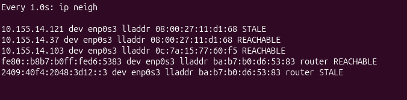


## 6. SIEM Detection with Splunk - ARP Audit Logs

Splunk is used to ingest Linux audit logs. Searching for arp in the index displays audit events indicating that the arp binary was executed. However, even though the MAC address of the gateway was altered during the attack, no logs provide direct information about the ARP table manipulation. This demonstrates that ARP spoofing can remain relatively stealthy without specialized monitoring tools such as arpwatch.

**Splunk Search:**
```
index=* arp
```


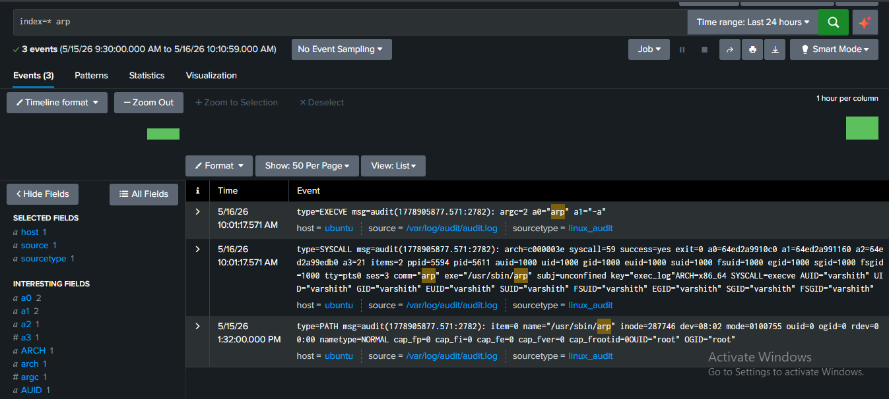


## 7. Installing and Configuring Arpwatch

To prevent the silent attack we can use `arpwatch` a tool that monitors ARP traffic on a network and alerts when MAC-to-IP mappings change, which is a direct indicator of ARP spoofing.

**Install arpwatch on the victim machine (Ubuntu):**

```bash
sudo apt install arpwatch -y
```


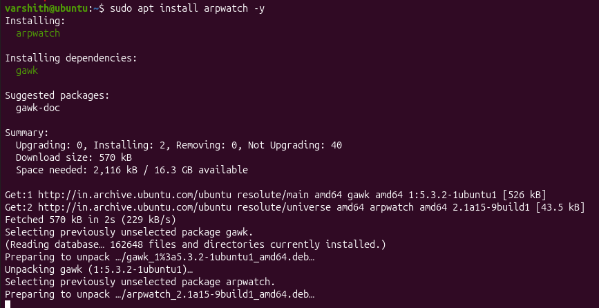


## 8. Arpwatch Running and Logging

After starting, arpwatch logs activity to the system syslog. The syslog entries confirm that arpwatch entered promiscuous mode on `enp0s3` and began listening.

```bash
sudo tail -f /var/log/syslog
```

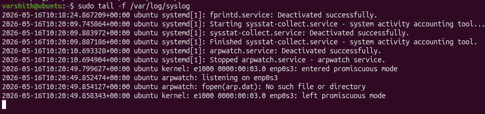

From this, it can be observed that an error in arpwatch is preventing it from performing its intended function of generating and sending alerts to the monitoring system (Splunk). Upon analysis, it was identified that the database file used by arpwatch to store ARP-related information was missing. By following the steps below, the issue can be resolved, allowing arpwatch to properly generate and forward alerts to Splunk.

**Create the required data file and set permissions:**

```bash
sudo mkdir -p /var/lib/arpwatch
sudo touch /var/lib/arpwatch/arp.dat
sudo chmod 644 /var/lib/arpwatch/arp.dat
sudo chown root:root /var/lib/arpwatch/arp.dat
```

**Run arpwatch in daemon mode on the interface:**

```bash
sudo arpwatch -i enp0s3 -d
```

When run for the first time, arpwatch sends a "new station" notification for each discovered host. The output below shows the gateway `10.155.14.37` being registered.

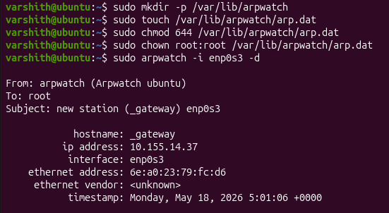


## 9. Forwarding Arpwatch Logs to Splunk via Logger

To forward arpwatch output to syslog (and subsequently to Splunk), redirect its output through `logger`. The `logger` command writes messages to `/var/log/syslog`, which Splunk's Universal Forwarder monitors.

```bash
sudo arpwatch -i enp0s3 -d 2>&1 | logger
```


This ensures all arpwatch alerts (new station, flip flop, changed ethernet address) are written to syslog and picked up by Splunk.


## 10. Splunk - Arpwatch Syslog Events

After the logger pipe is set up, Splunk begins receiving arpwatch events from `/var/log/syslog`. The Splunk search below shows a stream of arpwatch notifications arriving in real time.

**Splunk Search:**
```
source="/var/log/syslog" arpwatch
```

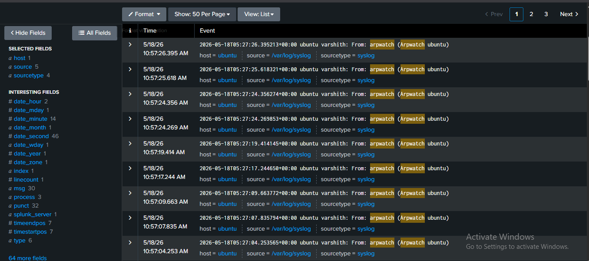

This confirms successful forwarding of ARP logs using arpwatch via `/var/log/syslog`.

## 11. Splunk - Flip Flop Alerts

The most critical arpwatch alert is a "flip flop" event. This occurs when the MAC address associated with an IP address changes back and forth, which is exactly what happens during an active ARP spoofing attack.

In Splunk, filtering for `flip flop` events shows repeated alerts for both `ubuntu` and `_gateway` on interface `enp0s3`, confirming that the ARP spoofing attack is being detected in real time.

**Splunk Search:**
```
source="/var/log/syslog" "flip flop"
```


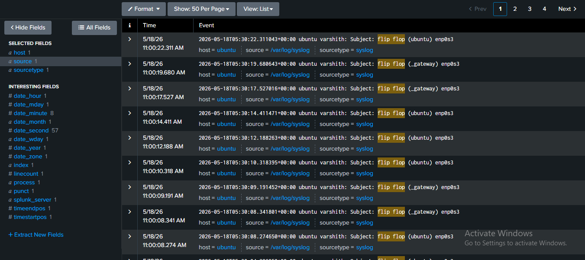

The high frequency of flip flop events (multiple per second) is a reliable indicator of an ongoing ARP poisoning attack.
